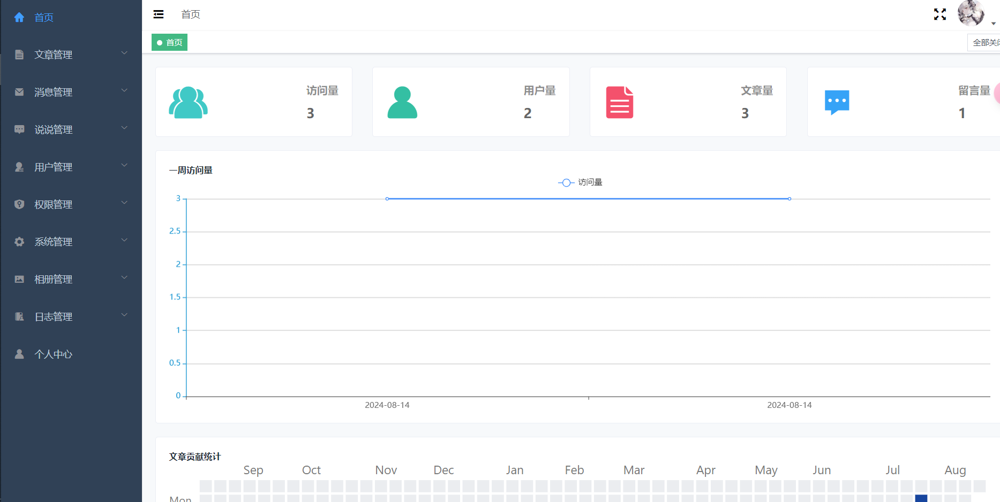
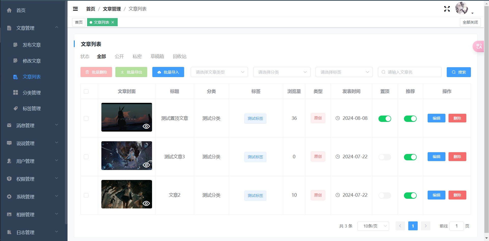
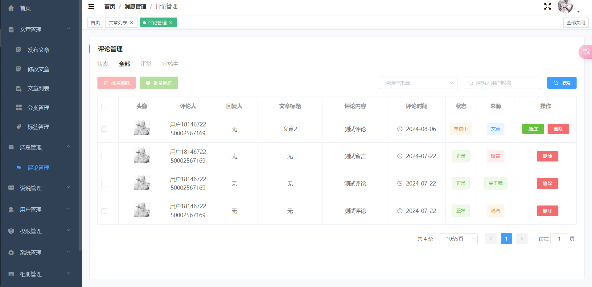
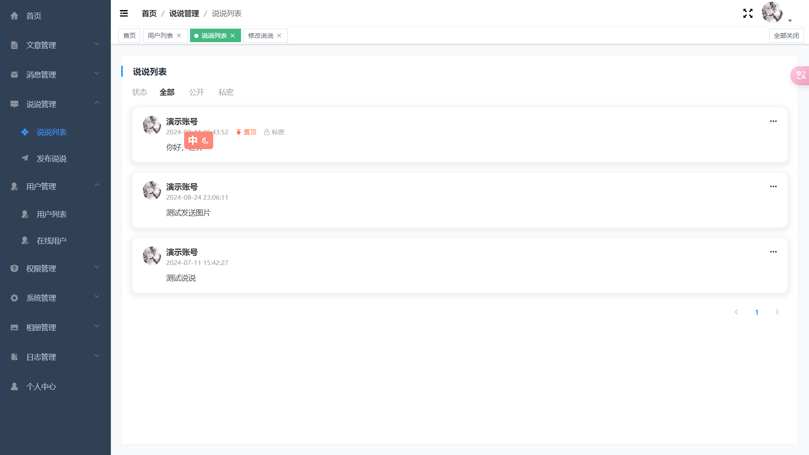
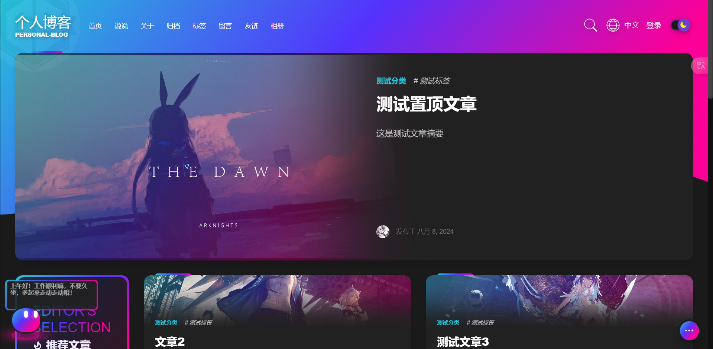
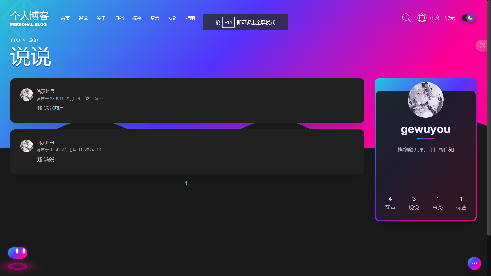

personal-blog

## 1. Introduction

This project is a multi-module personal blog project, written with reference to the
project [aurora](https://github.com/linhaojun857/aurora). My personal level is limited, and you can ask iss if you have
any questions

## 2. Architecture

1. **personal-blog-common**

- Provides common tool classes, constants, exception handling and other functions for other modules to share and use.
- Defines common data models and interfaces to promote decoupling and collaborative work between modules.

2. **personal-blog-server**

- Implements the core business logic and functions of the blog, such as article management, comment system, user
  management, etc.
- Provides API interfaces for front-end or other modules to call.

3. **personal-blog-admin**(under development)

- Provides a management backend interface for the management and maintenance of blog content.
- Implements management functions such as user authority management, content review, and data statistics.

4. **personal-blog-search**(not yet developed)

- Responsible for the search and retrieval functions of blog content.
- Integrate search engines such as Elasticsearch to provide users with efficient and accurate search experience.

5. **personal-blog-eureka**

- As a service registration center, manage and maintain the registration information of all microservices.
- Implement service discovery and load balancing to ensure communication and collaboration between microservices.

6. **personal-blog-extension**(not yet developed)

- Provide blog extension functions and plug-in support.
- Allow users to customize and extend the functions of blogs, such as gadgets, third-party integration, etc.

7. **personal-blog-gateway**

- As the entry point for all external requests, it handles request routing, load balancing, security authentication,
  traffic control, etc.
- Forwards requests to the corresponding backend services, and processes responses and returns them to the client.
8. **personal-blog-config**

- As the configuration center of the service, it manages and maintains the configuration information of all
  microservices
- Reduces the modification cost of all configurations, ensuring the maintainability, scalability and runtime security of
  the project

9. **personal-blog-security**

- As the public security module of the project, it is used for authentication and authorization
- Provides security functions for blog projects

10. **personal-blog-aurora-vue**

- The front-end modules of the project are divided into admin and blog

## 3. Technology

- Basic framework: springboot
- ORM framework: mybatisplus
- Permission framework: springsecurity
- Cache middleware: redis
- Message middleware: rabbitmq
- Search engine: elasticsearch
- Object storage: minio qiniu
- Scheduled tasks: quartz
- Other technologies: See the project's pom.xml

## 4. Effect diagram

#### Backstage

Home



Article list



Comment management



Scheduled tasks


Album management


Talk about it



For more information, please refer to the display in the project

#### Front page

Home page



Article


Album

! [image-20240818114233958](./assets/README/image-20240818114233958.png)

Talk about it



For more information, please refer to the project

## 5. Project startup tutorial

#### Prerequisites

This project requires MySql, Redis, RabbitMq, so make sure you have installed them

#### Download

First, use git to clone this project

Open your terminal and execute

```sh
git clone https://gitee.com/gewuyou/personal-blog.git
```

Then open the sql folder in the project root directory and execute the sql script personal_blog.sql in the database

#### Note

1. Since most of the configurations are placed in the configuration center, if you encounter a situation where you need
   to customize the configuration, it is recommended to configure it in the target module and then move it to the
   corresponding configuration of the config module

2. The local strategy is used by default for image file uploads. Currently, Qiniu Cloud, Minio, and Oss are supported.
   Please note that if object storage is used, you can delete the **/assets/blog** folder in the project root directory.
   It contains the image files I pre-stored, and all uploaded images will be stored in it

3. The configuration center uses the local configuration path in personal-blog-config/src/main/resources/conf by
   default. Of course, you can also use git as the configuration file provider

4. The default administrator account and password are admin and 123456

#### Startup

Startup sequence

1. config(8888)
2. eureka(10086) gateway(8082)
3. admin(8081) server(8084)

## 6. Docker deployment tutorial

1. First, we open Maven and click clean on the parent module to clean the build results

2. Install the common module, click the common submodule and click install

3. Install the security module, click the security submodule and click install

4. Then package the remaining modules with Application and click package

5. Create a folder (personal-blog) on your Linux and create folders for the corresponding submodules (for example:
   server, config)

6. Find the root directory of the corresponding submodule and upload it to the folder, as well as the corresponding jar
   package in the target directory (for example, personal-blog-admin-0.1.0.jar)

7. Enter the corresponding submodule directory and execute the command

8. Example

   ```sh
   # Enter the directory of the corresponding submodule. The directory must contain the DockerFile and the jar package corresponding to the submodule
   cd /usr/src/personal-blog/server/
   # personal-blog-server is the image name of the module you want to set after building
   docker build -t personal-blog-server .
   # The execution result is as follows
   #[+] Building 5.8s (8/8) FINISHED docker:default
   # => [internal] load build definition from Dockerfile 0.0s
   # => => transferring dockerfile: 777B 0.0s
   # => [internal] load metadata for docker.io/library/openjdk:17 0.0s
   # => [internal] load .dockerignore 0.0s
   # => => transferring context: 2B 0.0s
   # => [1/3] FROM docker.io/library/openjdk:17 0.0s
   # => [internal] load build context 2.7s
   # => => transferring context: 257.12MB 2.7s
   # => CACHED [2/3] WORKDIR /app 0.0s
   # => [3/3] COPY personal-blog-server-0.1.0.jar /app/personal-blog-server.jar 2.1s
   # => exporting to image 1.0s
   # => => exporting layers 1.0s
   # => => writing image sha256:f9708fab858291438232881489903fdb036dce07c987e59081f0c4baa627abea 0.0s
   # => => naming to docker.io/library/personal-blog-server
   # 8084:8084 port mapping server startup container name personal-blog-server built image name
   docker run -d -p 8084:8084 --name server personal-blog-server
   ```

More convenient deployment operations will be released later, but this is the case for now