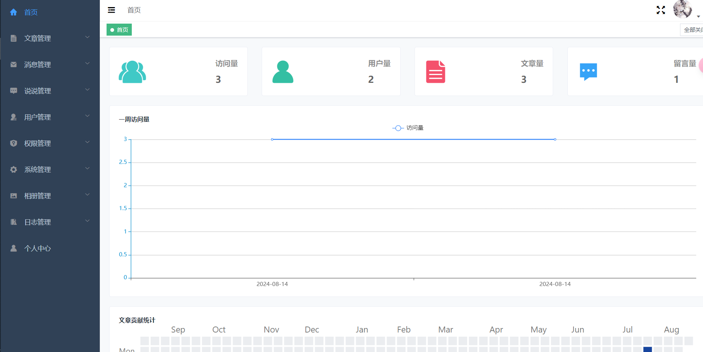
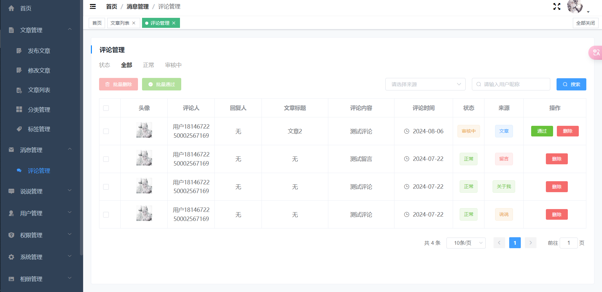
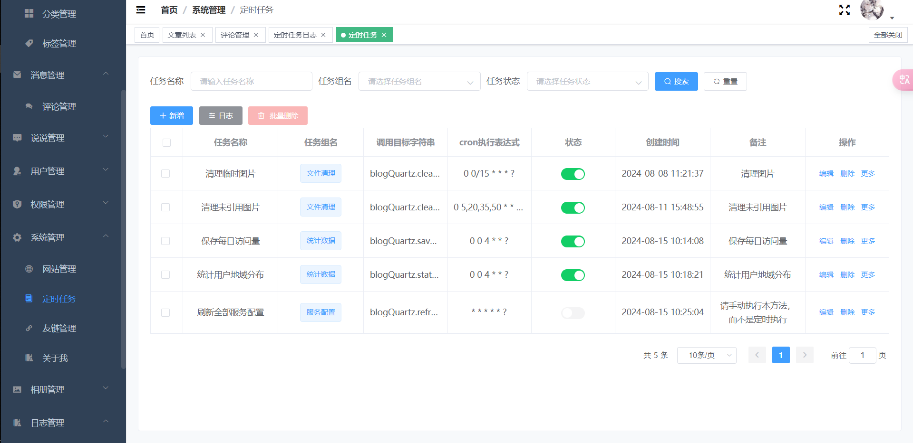
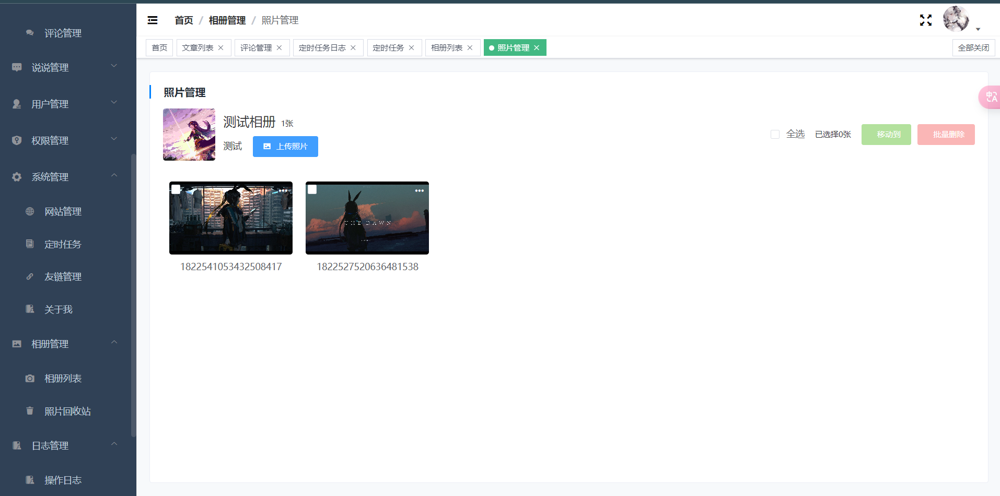
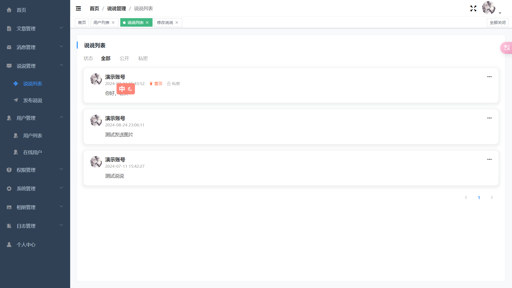
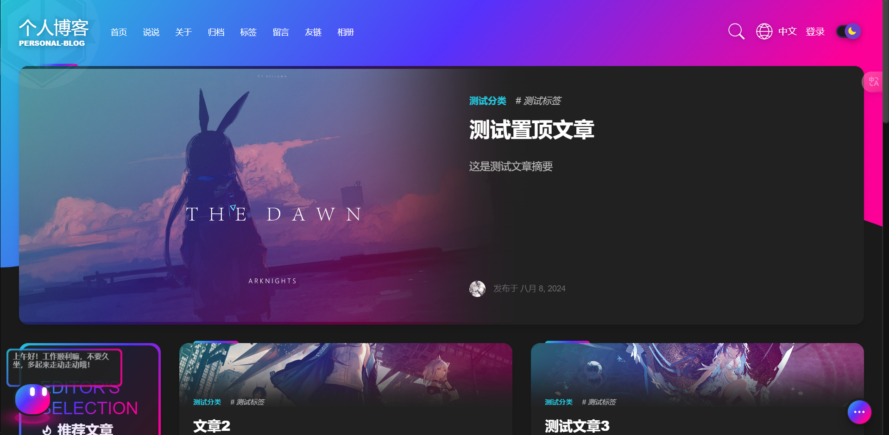
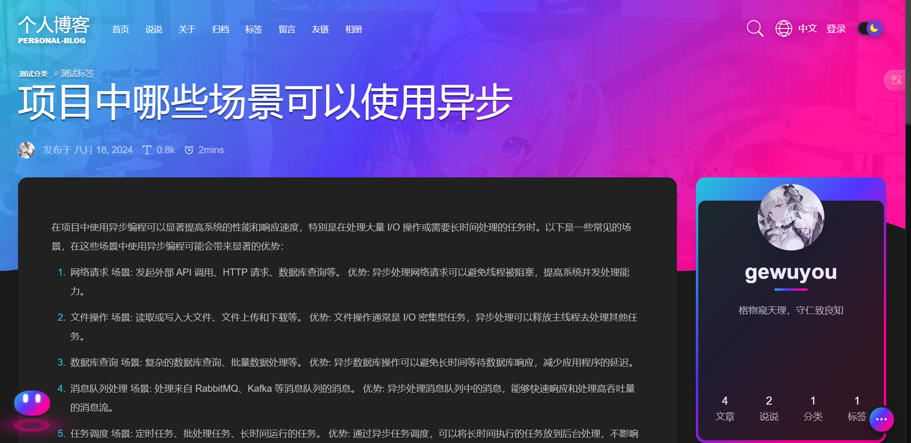
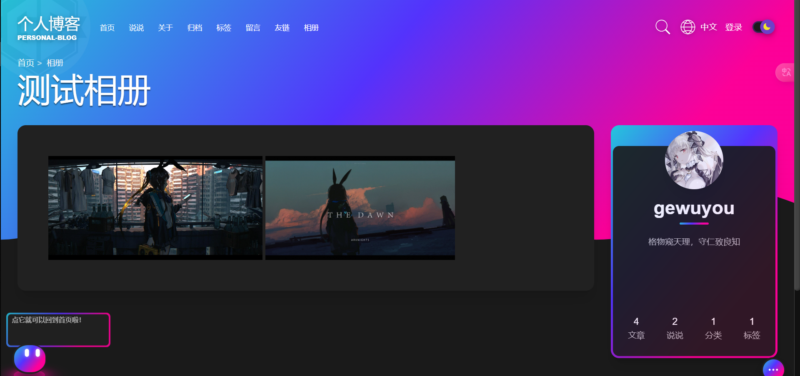
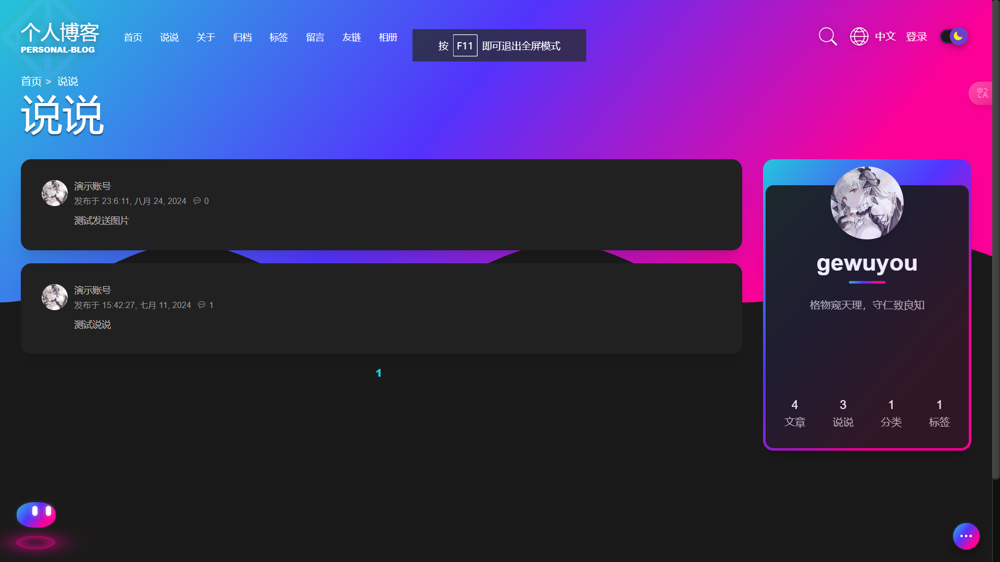

# personal-blog

## 一、简介

本项目是一个多模块的个人博客项目，参考项目https://github.com/linhaojun857/aurora 编写的，个人水平有限，有问题可以提iss

## 二、架构

1. **personal-blog-common**
   - 提供通用的工具类、常量、异常处理等功能，供其他模块共享和使用。
   - 定义公共的数据模型和接口，促进模块间的解耦和协同工作。
2. **personal-blog-server**
   - 实现博客的核心业务逻辑和功能，如文章管理、评论系统、用户管理等。
   - 提供 API 接口，供前端或其他模块调用。
3. **personal-blog-admin**(正在开发)
   - 提供管理后台界面，用于博客内容的管理和维护。
   - 实现用户权限管理、内容审核、数据统计等管理功能。
4. **personal-blog-search**(还未开发)
   - 负责博客内容的搜索和检索功能。
   - 集成搜索引擎，如 Elasticsearch，为用户提供高效、准确的搜索体验。
5. **personal-blog-eureka**
   - 作为服务注册中心，管理和维护所有微服务的注册信息。
   - 实现服务发现和负载均衡，确保微服务间的通信和协同工作。
6. **personal-blog-extension**(还未开发)
   - 提供博客的扩展功能和插件支持。
   - 允许用户自定义和扩展博客的功能，如小工具、第三方集成等。
7. **personal-blog-gateway**
   - 作为所有外部请求的入口点，处理请求路由、负载均衡、安全认证、流量控制等。
   - 将请求转发到相应的后端服务，并处理响应返回给客户端。
8. **personal-blog-config**
    - 作为服务的配置中心，管理和维护所有微服务的配置信息
    - 减少所有配置的修改成本，确保了项目的可维护性、可扩展性和运行时的安全性

## 三、技术

- 基础框架：springboot
- ORM框架：mybatisplus
- 权限框架：springsecurity
- 缓存中间件：redis
- 消息中间件：rabbitmq
- 搜索引擎：elasticsearch
- 对象存储：minio qiniu
- 定时任务：quartz
- 其他技术：参见项目的pom.xml

## 四、效果图

#### 后台

首页



文章列表


评论管理



定时任务



相册管理



说说



更多参见项目中的展示

#### 前台

首页



文章



相册



说说



更多参见项目中的展示

## 五、项目启动教程

#### 前置要求

本项目需要MySql、Redis、RabbitMq因此请确保你已经安装了它们

#### 下载

首先使用git克隆本项目

打开你的终端执行

```sh
git clone https://gitee.com/gewuyou/personal-blog.git
```

接着打开项目根目录下的sql文件夹，在数据库中执行其中的sql脚本personal_blog.sql即可

#### 注意

1. 由于大部分配置都放到了配置中心，如果遇到需要自定义的配置的情况建议在目标模块中配置好再移动到config模块对应的配置中
2. 图片文件上传默认使用本地策略，目前支持七牛云、Minio、Oss，请注意，如果使用对象存储，可以删除项目根目录下的**/assets/blog**
   文件夹，里面是我预先存放的图片文件，所有上传的图片会存放在其中，请使用带https的图片url，http的远程访问不知道为什么默认会变成https，如果有知道怎么解决的可以跟我说一下
3. 配置中心默认使用本地配置路径在personal-blog-config/src/main/resources/conf，当然你也可以使用git作为配置文件提供者
4. 默认的管理员账号和密码是admin 和 123456

#### 启动

启动顺序

1. config
2. eureka gateway
3. admin server
