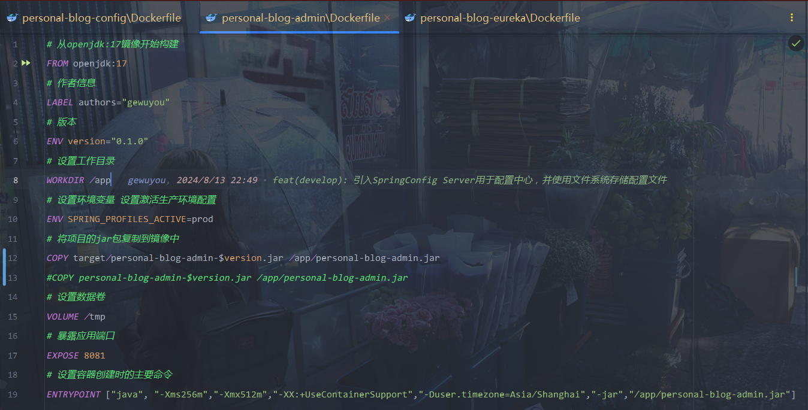

# personal-blog

## 一、简介

本项目是一个多模块的个人博客项目，参考项目[aurora](https://github.com/linhaojun857/aurora) 编写的，个人水平有限，有问题可以提iss

## 二、架构

1. **personal-blog-common**
   - 提供通用的工具类、常量、异常处理等功能，供其他模块共享和使用。
   - 定义公共的数据模型和接口，促进模块间的解耦和协同工作。
2. **personal-blog-server**
   - 实现博客的核心业务逻辑和功能，如文章管理、评论系统、用户管理等。
   - 提供 API 接口，供前端或其他模块调用。
3. **personal-blog-admin**(正在开发)
   - 提供管理后台界面，用于博客内容的管理和维护。
   - 实现用户权限管理、内容审核、数据统计等管理功能。
4. **personal-blog-search**(还未开发)
   - 负责博客内容的搜索和检索功能。
   - 集成搜索引擎，如 Elasticsearch，为用户提供高效、准确的搜索体验。
5. **personal-blog-eureka**
   - 作为服务注册中心，管理和维护所有微服务的注册信息。
   - 实现服务发现和负载均衡，确保微服务间的通信和协同工作。
6. **personal-blog-extension**(还未开发)
   - 提供博客的扩展功能和插件支持。
   - 允许用户自定义和扩展博客的功能，如小工具、第三方集成等。
7. **personal-blog-gateway**
   - 作为所有外部请求的入口点，处理请求路由、负载均衡、安全认证、流量控制等。
   - 将请求转发到相应的后端服务，并处理响应返回给客户端。
8. **personal-blog-config**
    - 作为服务的配置中心，管理和维护所有微服务的配置信息
    - 减少所有配置的修改成本，确保了项目的可维护性、可扩展性和运行时的安全性
9. **personal-blog-security**
   - 作为项目的公共安全模块用于认证与授权
   - 提供博客项目的安全功能

10. **personal-blog-aurora-vue**
    - 项目的前端模块分为admin和blog

## 三、技术

- 基础框架：springboot
- ORM框架：mybatisplus
- 权限框架：springsecurity
- 缓存中间件：redis
- 消息中间件：rabbitmq
- 搜索引擎：elasticsearch
- 对象存储：minio qiniu
- 定时任务：quartz
- 其他技术：参见项目的pom.xml

## 四、效果图

#### 后台

首页


文章列表


评论管理


定时任务


相册管理


说说


更多参见项目中的展示

#### 前台

首页


文章


相册


说说


更多参见项目中的展示

## 五、项目启动教程

#### 前置要求

本项目需要MySql、Redis、RabbitMq因此请确保你已经安装了它们

#### 下载

首先使用git克隆本项目

打开你的终端执行

```sh
git clone https://gitee.com/gewuyou/personal-blog.git
```

接着打开项目根目录下的sql文件夹，在数据库中执行其中的sql脚本personal_blog.sql即可

#### 注意

1. 由于大部分配置都放到了配置中心，如果遇到需要自定义的配置的情况建议在目标模块中配置好再移动到config模块对应的配置中
2. 图片文件上传默认使用本地策略，目前支持七牛云、Minio、Oss，请注意，如果使用对象存储，可以删除项目根目录下的**/assets/blog**
   文件夹，里面是我预先存放的图片文件，所有上传的图片会存放在其中
3. 配置中心默认使用本地配置路径在personal-blog-config/src/main/resources/conf，当然你也可以使用git作为配置文件提供者
4. 默认的管理员账号和密码是admin 和 123456

#### 启动

启动顺序

1. config(8888)
2. eureka(10086) gateway(8082)
3. admin(8081) server(8084)

## 六、Docker部署教程

### 操作一(不推荐)

1. 首先我们先点开Maven点击父模块的clean清理构建结果

2. 安装common模块，点开common子模块点击install

3. 安装security模块，点开security子模块点击install

4. 然后打包其余具有Application的模块，点击package

5. 在你的Linux上创建一个文件夹(personal-blog)并创建对应子模块的文件夹(例如：server、config)

6. 找到对应子模块的根目录有一个DockerFile将其上传至文件夹中，还有target目录下对应的jar包(
   例如personal-blog-admin-0.1.0.jar) 注意复制路径

   ```sh
   # 从openjdk:17镜像开始构建
   FROM openjdk:17
   # 作者信息
   LABEL authors="gewuyou"
   # 版本
   ENV version="0.1.0"
   # 设置工作目录
   WORKDIR /app
   # 设置环境变量 设置激活生产环境配置
   ENV SPRING_PROFILES_ACTIVE=prod
   # 将项目的jar包复制到镜像中
   #COPY target/personal-blog-admin-$version.jar.jar /app/personal-blog-admin.jar
   COPY personal-blog-admin-$version.jar /app/personal-blog-admin.jar
   # 设置数据卷
   VOLUME /tmp
   # 暴露应用端口
   EXPOSE 8081
   # 设置容器创建时的主要命令
   ENTRYPOINT ["java", "-Xms256m","-Xmx512m","-XX:+UseContainerSupport","-Duser.timezone=Asia/Shanghai","-jar","/app/personal-blog-admin.jar"]
   ```


7. 进入到对应子模块目录执行命令

8. 示例

   ```sh
   # 进入对应子模块的目录 目录中必须有DockerFile 和子模块对应的jar包
   cd /usr/src/personal-blog/server/
   # personal-blog-server为你想要设置的模块构建后的镜像名字
   docker build -t personal-blog-server .
   # 执行结果形如
   #[+] Building 5.8s (8/8) FINISHED                                                                                 docker:default
   # => [internal] load build definition from Dockerfile                                                                       0.0s
   # => => transferring dockerfile: 777B                                                                                       0.0s
   # => [internal] load metadata for docker.io/library/openjdk:17                                                              0.0s
   # => [internal] load .dockerignore                                                                                          0.0s
   # => => transferring context: 2B                                                                                            0.0s
   # => [1/3] FROM docker.io/library/openjdk:17                                                                                0.0s
   # => [internal] load build context                                                                                          2.7s
   # => => transferring context: 257.12MB                                                                                      2.7s
   # => CACHED [2/3] WORKDIR /app                                                                                              0.0s
   # => [3/3] COPY personal-blog-server-0.1.0.jar /app/personal-blog-server.jar                                                2.1s
   # => exporting to image                                                                                                     1.0s
   # => => exporting layers                                                                                                    1.0s
   # => => writing image sha256:f9708fab858291438232881489903fdb036dce07c987e59081f0c4baa627abea                               0.0s
   # => => naming to docker.io/library/personal-blog-server    
   # 8084:8084端口映射 server启动后的容器名 personal-blog-server构建的镜像名
   docker run -d -p 8084:8084 --name server personal-blog-server
   ```

### 操作二

#### 准备工作:

在idea中构建dockerFile需要在本机安装docker，通常我们会下载Docker for
Windows，但不推荐这种方法，我电脑安装之后VM就歇逼了，而且我电脑太拉跨，安装后docker启动了就关不了了，得关进程，因此我们选择另外一种方法

首先下载[docker.exe](https://download.docker.com/win/static/stable/x86_64/)

解压后，在idea - 设置 - 构建、执行、部署 - Docker中找到工具，选择docker.exe解压的位置，点击确定


设置完后，执行大概率会出现buildx工具找不到的问题

接着我们需要安装buildx工具

在你的用户文件夹下（或在文件管理地址栏输入 %USERPROFILE% 定位）

新建 .docker 文件夹（注意有个“.”,如果已经有了那就不用新建）

在 .docker 下面再新建一个 cli-plugins文件夹(这个应该是没有)


下载文件[docker-buildx.exe](https://github.com/docker/buildx/releases/download)

进去后自己根据自己的电脑选版本

下载下来，然后重命名为 docker-buildx.exe，然后放入cli-plugins文件夹中

效果如下图


#### 构建配置：

这边我使用admin模块举例

这是配置，注意这个COPY路径根据你的打包后jar包的位置设置



点开运行/调试配置，拉到最下面点击编辑配置


接着我们新增一个配置


这是初步设置


接着我们创建执行前的maven构建任务

指定好目标目录和清理与打包命令，注意如果依赖模块有修改，需要清理并安装依赖模块


#### 运行结果：


#### 参考资料:

- [使用Idea创建一键部署项目到Docker(保姆级教程)](https://blog.csdn.net/weixin_42782429/article/details/131848057)
- [IDEA 2024无法远程构建dockerfile，报错cannot run program](https://www.colortimbre.com/archives/1720704825386)
